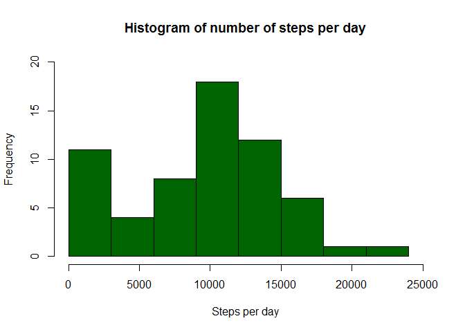
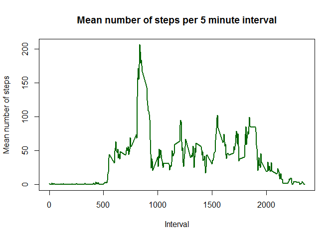
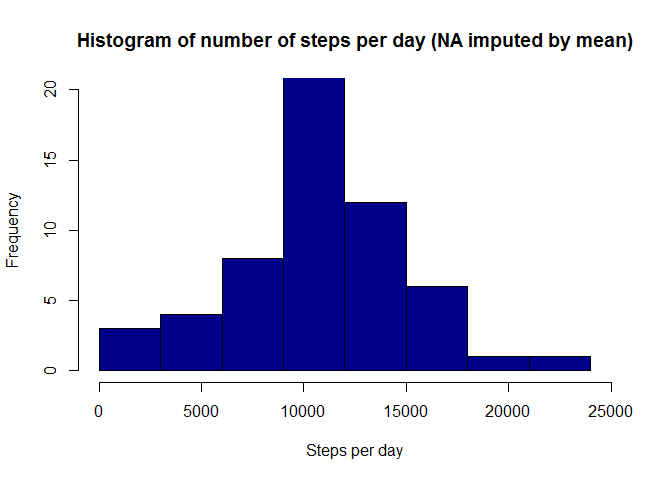
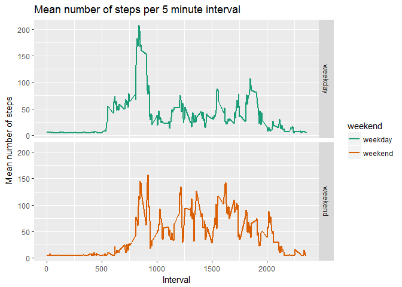

Peer-graded Assignment: Course Project 1
----------------------------------------

#Introduction

It is now possible to collect a large amount of data about personal movement using activity monitoring devices such as a Fitbit, Nike Fuelband, or Jawbone Up. These type of devices are part of the “quantified self” movement – a group of enthusiasts who take measurements about themselves regularly to improve their health, to find patterns in their behavior, or because they are tech geeks. But these data remain under-utilized both because the raw data are hard to obtain and there is a lack of statistical methods and software for processing and interpreting the data.

This assignment makes use of data from a personal activity monitoring device. This device collects data at 5 minute intervals through out the day. The data consists of two months of data from an anonymous individual collected during the months of October and November, 2012 and include the number of steps taken in 5 minute intervals each day.

The data for this assignment can be downloaded from the course web site:

Dataset: Activity monitoring data [52K]
The variables included in this dataset are:

steps: Number of steps taking in a 5-minute interval (missing values are coded as NA)
date: The date on which the measurement was taken in YYYY-MM-DD format
interval: Identifier for the 5-minute interval in which measurement was taken
The dataset is stored in a comma-separated-value (CSV) file and there are a total of 17,568 observations in this dataset.

##Loading and preprocessing the data

Show any code that is needed to:
- Load the data (i.e. read.csv())
- Process/transform the data (if necessary) into a format suitable for your analysis


```r
##setting workingdirectories
wd <- getwd()

##create dir for file te download
if(!file.exists("./data")){dir.create("./data")}
fileUrl <- "https://d396qusza40orc.cloudfront.net/repdata%2Fdata%2Factivity.zip"
download.file(fileUrl,destfile="./data/Dataset.zip")

##unzip the file
unzip(zipfile = "./data/Dataset.zip", exdir="./data")

##check if the files are there
fp <- file.path(getwd(),"data")
list.files(fp, recursive = TRUE)
```

```
## [1] "activity.csv" "Dataset.zip"
```

```r
##set wd to location of file
setwd(fp)

##read csv and create dataframe
act <- read.csv("activity.csv", stringsAsFactors = FALSE)

##set back to working directory
setwd(wd)

##lubridate is great for handling dates
library(lubridate)
```

```
## 
## Attaching package: 'lubridate'
```

```
## The following object is masked from 'package:base':
## 
##     date
```

```r
##add weekday and indication of weekday/weekend; needed later in the assignment
act$date <- ymd(act$date)
act$date_wday <- weekdays(act$date)
act$date_weekend <- "weekday"
act$date_weekend[which(act$date_wday=="zaterdag")] <- "weekend"
act$date_weekend[which(act$date_wday=="zondag")] <- "weekend"
```


##What is mean total number of steps taken per day?

For this part of the assignment, you can ignore the missing values in the dataset.

Calculate the total number of steps taken per day
If you do not understand the difference between a histogram and a barplot, research the difference between them. Make a histogram of the total number of steps taken each day


```r
##aggregate data
act_steps_per_day <- as.data.frame(tapply(act$steps, act$date, sum, na.rm = TRUE))
act_steps_per_day$date <- rownames(act_steps_per_day)
colnames(act_steps_per_day) <- c("steps","date")
##mean(act_steps_per_day$steps)

##create histogram
hist(act_steps_per_day$steps,
     xlab = "Steps per day",
     ylim = c(0,20),
     xlim = c(0,25000),
     main = "Histogram of number of steps per day", 
     col = "dark green",
     breaks=seq(from=0, to=25000, by=3000))
```

<!-- -->


##Calculate and report the mean and median of the total number of steps taken per day

```r
mean_1 <- mean(act_steps_per_day$steps)
```

```r
median_1 <- median(act_steps_per_day$steps)
```
The mean number of steps is 9354.2295082; the median number of steps is 10395.

##What is the average daily activity pattern?

Make a time series plot (i.e. type = "l") of the 5-minute interval (x-axis) and the average number of steps taken, averaged across all days (y-axis)


```r
##aggregate data
act_steps_per_int <- aggregate(act$steps, 
                               by=list(act$interval), 
                               FUN=mean, 
                               na.rm=TRUE)
act_steps_per_int$interval <- rownames(act_steps_per_int)
colnames(act_steps_per_int) <- c("interval","steps","intervalnumber")

##create plot
plot(act_steps_per_int$interval,
     act_steps_per_int$steps, 
     type = "l", 
     col = "dark green", 
     lwd = 2,
     main = "Mean number of steps per 5 minute interval",
     xlab = "Interval",
     ylab = "Mean number of steps")
```

<!-- -->


##Which 5-minute interval, on average across all the days in the dataset, contains the maximum number of steps?

```r
maxsteps<- act_steps_per_int$interval[which.max(act_steps_per_int$steps)]
```
This interval contains the maximum number of steps: 835

##Imputing missing values

Note that there are a number of days/intervals where there are missing values (coded as NA). The presence of missing days may introduce bias into some calculations or summaries of the data.

Calculate and report the total number of missing values in the dataset (i.e. the total number of rows with NAs)

```r
##count number of missings
numbermissing<- sum(is.na(act$steps))
```
The number of missing values in the dataset is 2304.


Devise a strategy for filling in all of the missing values in the dataset. The strategy does not need to be sophisticated. For example, you could use the mean/median for that day, or the mean for that 5-minute interval, etc.
Create a new dataset that is equal to the original dataset but with the missing data filled in.

```r
##package for imputation
library(Hmisc)
```

```
## Warning: package 'Hmisc' was built under R version 3.3.3
```

```
## Loading required package: lattice
```

```
## Loading required package: survival
```

```
## Warning: package 'survival' was built under R version 3.3.3
```

```
## Loading required package: Formula
```

```
## Loading required package: ggplot2
```

```
## Warning: package 'ggplot2' was built under R version 3.3.3
```

```
## 
## Attaching package: 'Hmisc'
```

```
## The following objects are masked from 'package:base':
## 
##     format.pval, round.POSIXt, trunc.POSIXt, units
```

```r
##copy df to impute missings
act_imp<- act

##impute missings
act_imp$imputed_steps <- with(act_imp, impute(act_imp$steps, mean))
```

Make a histogram of the total number of steps taken each day and Calculate and report the mean and median total number of steps taken per day.

```r
##create histogram with imputed data
##first, summarize data
actimp_steps_per_day <- as.data.frame(tapply(act_imp$imputed_steps, act_imp$date, sum))
actimp_steps_per_day$date <- rownames(actimp_steps_per_day)
colnames(actimp_steps_per_day) <- c("steps","date")


##create histogram
hist(actimp_steps_per_day$steps,
     xlab = "Steps per day",
     ylim = c(0,20),
     xlim = c(0,25000),
     main = "Histogram of number of steps per day (NA imputed by mean)", 
     col = "dark blue",
     breaks=seq(from=0, to=25000, by=3000))
```

<!-- -->

```r
mean_2 <- as.integer(mean(actimp_steps_per_day$steps))
median_2<- as.integer(median(actimp_steps_per_day$steps))
```

*The mean number of steps for the imputed data is 10766 and the median is 10766.*


Do these values differ from the estimates from the first part of the assignment?

*The mean and median before data-imputation were 9354.2295082 and 10395; as you can see, mean and median are higher.*


What is the impact of imputing missing data on the estimates of the total daily number of steps?

*The impact is, that some data in dataframe is now filled. So the estimates will be higher.*


##Are there differences in activity patterns between weekdays and weekends?

For this part the weekdays() function may be of some help here. Use the dataset with the filled-in missing values for this part.

Create a new factor variable in the dataset with two levels – “weekday” and “weekend” indicating whether a given date is a weekday or weekend day.

*This was already done when reading and preparing the data.*

Make a panel plot containing a time series plot (i.e. type = "l") of the 5-minute interval (x-axis) and the average number of steps taken, averaged across all weekday days or weekend days (y-axis). See the README file in the GitHub repository to see an example of what this plot should look like using simulated data.


```r
##first aggregate the data
actimp_steps_per_int <- aggregate(act_imp$imputed_steps, 
                               by=list(act_imp$interval, act_imp$date_weekend), 
                               FUN=mean, 
                               na.rm=TRUE)
actimp_steps_per_int$interval <- rownames(actimp_steps_per_int)
colnames(actimp_steps_per_int) <- c("interval","weekend","steps","intervalnumber")

##start the ggplot-package
library(ggplot2)

##then create a plot
ggplot(actimp_steps_per_int, aes(interval, steps)) + 
      geom_line(aes(color = weekend), size = 1) + 
      facet_grid(weekend ~ .) +
      xlab("Interval") + 
      ylab("Mean number of steps") +
      labs(title = "Mean number of steps per 5 minute interval") +
      scale_color_brewer(palette="Dark2")
```

<!-- -->

